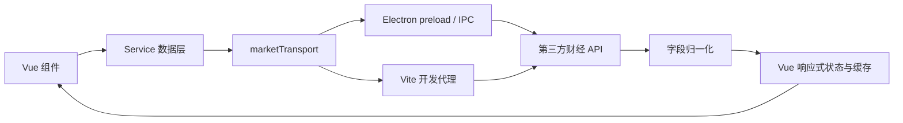

# BigA 项目逻辑与 API 说明

更新时间：2026-07-12

本文用于说明 BigA 当前的产品结构、代码分层、数据流、第三方 API、字段映射、刷新策略与回退逻辑。项目目前是只读监盘终端，不包含交易下单能力。

## 1. 产品工作区

顶部工作区由 `src/App.vue` 中的 `activeTab` 控制，目前没有引入 Vue Router，页面切换不会创建浏览器路由。

| 工作区 | 核心任务 | 主要实现 |
| --- | --- | --- |
| 新闻 | 浏览 A 股快讯、资讯和应用内正文 | `App.vue`、`newsProvider.ts` |
| 市场监控 | 判断市场情绪、查看龙虎榜、跟踪资金流向 | `MarketMonitor.vue`、`marketMonitorProvider.ts` |
| 热门板块 | 按热度、涨幅、资金、扩散度寻找主线 | `App.vue`、`SectorDetailPanel.vue` |
| 热门股票 | 查看活跃股票排行和分时/日周月 K 线 | `App.vue`、`KLineChart.vue` |
| 知识库 | 学习交易术语，并用真实行情查看规则案例 | `TradingKnowledge.vue`、`KnowledgeCaseStudy.vue` |
| 自选股 | 搜索、持久化股票池、查看行情和 F10 | `App.vue`、`eastmoneyProvider.ts` |

三个容易混淆的市场页面已经拆分职责：

- `市场监控`回答现在能不能做、资金往哪里走、龙虎榜席位在交易什么。
- `热门板块`回答当前最强主线和扩散方向是什么。
- `热门股票`回答具体有哪些高活跃个股，以及个股当前走势如何。

## 2. 代码分层

```text
src/
├── App.vue                         顶层工作区、共享状态、页面跳转
├── components/
│   ├── KLineChart.vue              分时和日/周/月 K 线
│   ├── TradingKnowledge.vue        术语词云、分类与概念解析
│   ├── KnowledgeCaseStudy.vue      真实股票教学案例
│   ├── KnowledgeLab.vue            今日雷达、回放训练、错题本
│   ├── MarketMonitor.vue           情绪、龙虎榜、资金流向
│   ├── WatchlistManager.vue        自选分组、标签、批量和导入导出
│   ├── AlertCenter.vue              提醒规则、历史与通知设置
│   └── SectorDetailPanel.vue       板块成分股下钻
├── services/
│   ├── marketTransport.ts          Electron IPC / Vite 代理统一入口
│   ├── marketCalendar.ts           A 股交易日与盘中阶段
│   ├── dataHealth.ts               行情新鲜度与回退状态
│   ├── adjustment.ts               复权参数与缓存变体语义
│   ├── watchlistState.ts            自选组织迁移、排序和 CSV/JSON
│   ├── alertEngine.ts               提醒条件、边沿触发与冷却去重
│   ├── eastmoneyProvider.ts        自选股实时行情 Provider
│   ├── marketMonitorProvider.ts    市场监控聚合数据
│   ├── sectorProvider.ts           板块、热门股、个股 K 线
│   ├── knowledgeCaseAnalyzer.ts    知识标签筛选、标注与解释规则
│   ├── knowledgePatternEngine.ts   六类模式扫描、证据与后续表现
│   ├── newsProvider.ts             新闻聚合与正文
│   ├── stockInfoProvider.ts        个股资讯、财务、公司、公告
│   ├── stockSearch.ts              A 股搜索
│   ├── historicalCandles.ts        新浪日线和周/月聚合
│   └── indicators.ts               MA、MACD、RSI 等指标
└── types/                          归一化后的领域类型
```

基本数据流：



UI 只消费项目内部类型，不直接依赖第三方字段名。新增数据源时应在 Service 层转换为现有类型，避免页面出现 `f2`、`f62` 一类供应商字段。

## 3. 网络请求与安全边界

### 3.1 Electron 运行时

`electron/preload.cjs` 只暴露两个受控方法：

```ts
window.bigA.fetchMarketText(url, encoding)
window.bigA.fetchNewsText(route)
```

`electron/main.cjs` 负责：

- 校验协议与域名白名单。
- 添加 `Referer` 和 `User-Agent`。
- 处理重定向、超时和字符编码。
- 保持 `contextIsolation: true` 与 `nodeIntegration: false`。

### 3.2 Web 开发模式

浏览器没有 Electron IPC 时，`marketTransport.ts` 请求 Vite 的 `/__biga_market` 代理。代理白名单在 `vite.config.ts`，应与 `electron/main.cjs` 同步维护。

新增 API 域名时必须同时修改：

1. `electron/main.cjs` 的 `allowedMarketHosts` 或 `allowedNewsHosts`。
2. `vite.config.ts` 的 `allowedMarketHosts`。

不要把任意 URL 透传给主进程，否则会形成 SSRF 风险。

### 3.3 请求治理

`marketTransport.ts` 对所有行情文本请求统一执行以下策略：

- 相同 `URL + encoding` 的并发请求复用同一个 Promise。
- 单次请求 12 秒超时，失败后等待 180ms 重试一次。
- 同一主机连续三轮请求失败后熔断 15 秒。
- 空响应按失败处理，不写入业务缓存。
- Vite 开发代理失败时不再静默回退为浏览器直连。
- 按数据主机记录本次运行的请求数、成功率、平均/最近延迟、重试、最近错误与熔断截止时间。
- 同时按 `Asia/Shanghai` 交易日聚合请求数、成功/失败、重试和成功请求延迟，保存在 `biga.market-transport-history.v1`，最多保留 90 天。

页面列表请求还会记录请求序号与发起时的 Tab、板块类型或排序方式。响应返回时若上下文已经变化，结果会被丢弃，避免慢响应覆盖用户刚切换的新视图。

### 3.4 交易日历与行情健康度

`marketCalendar.ts` 固定使用 `Asia/Shanghai`，区分盘前、开盘集合竞价、上午连续竞价、午间休盘、下午连续竞价、收盘集合竞价和盘后。2026 年休市日使用项目内配置表；其他年份仅按周末与工作日推断，并通过 `calendarConfidence: weekday-only` 明示可信边界。该配置不是长期有效的官方交易日服务，跨年时必须更新交易所休市表。

报价时间优先使用数据源字段：东方财富 `f124`、新浪行情日期与时间、日线 K 自身日期。数据源缺少时间时不会写入本机 `Date.now()` 冒充实时行情。

热门板块和热门股票的行数据同时保存 `updatedAt` 与 `fetchedAt`：前者仅表示供应商明确给出的行情时间，后者表示 BigA 完成本次请求的时间。页面标题在没有前者时显示“拉取 HH:mm”，而不使用“实时”措辞。

`dataHealth.ts` 根据市场阶段、最近供应商时间和源标签输出：`live`、`delayed`、`stale`、`fallback`、`error`、`idle`、`closed`。交易中 15 秒内视为实时，15-60 秒视为延迟，超过 60 秒视为陈旧；休市期间旧收盘数据归为 `closed`，不会误报为盘中陈旧。

## 4. 行情与 K 线 API

### 4.1 自选股实时行情

主实现：`src/services/eastmoneyProvider.ts`

| 优先级 | API | 用途 |
| --- | --- | --- |
| 主源 | `push2.eastmoney.com/api/qt/ulist.np/get` | 批量价格、涨跌、成交、估值、行业 |
| 辅源 | `hq.sinajs.cn/list=...` | 实时报价和五档盘口 |
| 兜底 | 新浪日 K | 主行情均失败时生成最近收盘快照 |

东方财富常用字段：

| 字段 | 含义 |
| --- | --- |
| `f2` | 最新价 |
| `f3` | 涨跌幅 |
| `f4` | 涨跌额 |
| `f5` | 成交量 |
| `f6` | 成交额 |
| `f7` | 振幅 |
| `f8` | 换手率 |
| `f9` | 市盈率 |
| `f12` / `f14` | 股票代码 / 名称 |
| `f15` / `f16` | 最高 / 最低 |
| `f17` / `f18` | 今开 / 昨收 |
| `f20` | 总市值 |
| `f100` | 行业名称 |

刷新频率：报价约 `3.8s`，K 线约 `90s`。

### 4.2 分时与历史 K 线

主实现：`src/services/sectorProvider.ts`、`src/services/historicalCandles.ts`

| 周期 | 主源 | 回退 |
| --- | --- | --- |
| 分时 | 东方财富 `stock/trends2/get` | 新浪 `CN_MinlineService.getMinlineData` |
| 日 K | 东方财富 `stock/kline/get` | 新浪 `CN_MarketDataService.getKLineData` |
| 周 K / 月 K | 东方财富对应周期 | 新浪日 K 在本地聚合 |

日、周、月 K 支持三种价格口径：

| 页面选项 | 东方财富参数 | 含义 | 回退策略 |
| --- | --- | --- | --- |
| 不复权 | `fqt=0` | 保留历史实际成交价和除权缺口 | 可回退新浪日 K，并在本地聚合周/月 |
| 前复权 | `fqt=1` | 以当前价格为基准调整历史价格 | 回退新浪原始日 K + `qfq.js` 真实因子 |
| 后复权 | `fqt=2` | 保留历史基准并累计公司行为影响 | 回退新浪原始日 K + `hfq.js` 真实因子 |

分时不参与复权。缓存键包含股票、周期和复权方式，避免不同口径互相覆盖。新浪复权回退先按每根 K 线日期匹配真实因子，前复权价格除以 `qfq` 因子、后复权价格乘以 `hfq` 因子，成交量保持原值，周/月 K 再由调整后的日 K 聚合。因子缺失时返回空数据，不会用未调整价格冒充复权 K 线。默认使用前复权，用户选择保存在 `biga.adjustment.v1`。

`KLineChart.vue` 负责：

- 分时价格线、均价线和成交量。
- 午间休市时间压缩。
- 分时全交易时段占位。
- 昨收 0% 参考线。
- 按 A 股板块规则计算涨跌停坐标范围。
- 日/周/月 K 线和 MA5、MA10、MA20。
- K 线副图支持 `VOL`、`MACD(DIF/DEA/BAR)`、`RSI6/RSI12`、`KDJ(K/D/J)`，选择结果保存在 `biga.chart-indicator.v1`。
- 日/周/月 K 支持悬停速览；单击固定周期详情，左右方向键切换，`Esc` 取消。东方财富日 K 展示成交额和换手率，新浪回退缺失时显示 `--`。
- 个股财务使用 ECharts 展示季度、累计和年度趋势。营收与归母净利润的单季度值由同年累计报告差分得到，并按同季度计算同比；ROE、毛利率、负债率等比率指标保持报告期口径。
- 禁止鼠标滚轮缩放，避免监盘时误操作。

## 5. 市场监控 API

主实现：`src/services/marketMonitorProvider.ts`

### 5.1 市场情绪

#### 涨跌家数

API：

- `Market_Center.getHQNodeStockCount?node=hs_a`
- `Market_Center.getHQNodeData?sort=changepercent&node=hs_a`

全市场约 5500 只股票，不逐页下载全部数据。实现会在按涨跌幅降序的数据中二分查找：

1. 第一只 `涨跌幅 <= 0` 的位置，得到上涨家数。
2. 第一只 `涨跌幅 < 0` 的位置，得到平盘和下跌家数。

该方式通常只需要约 12 个分页请求，明显小于下载全部股票。

#### 涨停、跌停和炸板

主源：

- `push2ex.eastmoney.com/getTopicZTPool`
- `push2ex.eastmoney.com/getTopicDTPool`
- `push2ex.eastmoney.com/getTopicZBPool`

可获得涨停数、跌停数、炸板数、连板数、首封时间、炸板次数和所属行业。

回退：新浪涨跌幅排序快照。回退模式按股票代码、ST、创业板、科创板、北交所规则判断价格限制，并用最高价判断炸板样本。

#### 指数快照

API：`hq.sinajs.cn/list=s_sh000001,s_sz399001,s_sz399006`

展示上证指数、深证成指、创业板指的最新点位、涨跌幅和成交额。

#### 情绪分

情绪分是对真实市场字段的可解释聚合，不是第三方直接返回值：

```text
情绪分 = 红盘覆盖 40%
       + 封板率 25%
       + 涨跌停平衡 20%
       + 三大指数平均表现 15%
```

分区：`冰点 < 25`、`偏冷 < 40`、`平衡 < 60`、`活跃 < 75`、其余为 `过热`。

#### 情绪复盘

`marketHistory.ts` 在市场情绪刷新成功后按 5 分钟桶保存一个紧凑快照，字段包括情绪分、红绿盘覆盖、涨跌停、炸板、封板率、连板高度和三大指数平均涨幅。相同时间桶内的刷新只更新快照，不重复追加。

复盘页使用 ECharts 对比情绪分、红盘覆盖和封板率，点击任一采集点可查看当时的结构指标及相邻快照变化。该历史从 BigA 在当前设备采集之日起积累，来源标记为“本机采集”，不是交易所或供应商提供的完整历史数据库。

### 5.2 龙虎榜

API：`datacenter-web.eastmoney.com/api/data/v1/get`

报表：`RPT_DAILYBILLBOARD_DETAILSNEW`

处理步骤：

1. 先取最新一条记录确定最近交易日。
2. 按交易日过滤并获取当日全部记录。
3. 同一股票可能因多个原因重复上榜，按代码去重。
4. 保留绝对净额更大的记录，并合并不同上榜原因。

主要字段：

| 字段 | 含义 |
| --- | --- |
| `BILLBOARD_BUY_AMT` | 龙虎榜买入额 |
| `BILLBOARD_SELL_AMT` | 龙虎榜卖出额 |
| `BILLBOARD_NET_AMT` | 龙虎榜净额 |
| `BILLBOARD_DEAL_AMT` | 龙虎榜成交额 |
| `DEAL_AMOUNT_RATIO` | 榜单成交占市场成交比例 |
| `EXPLANATION` | 上榜原因 |
| `EXPLAIN` | 席位或机构特征摘要 |

席位详情中的“完整行情”会复用热门股票详情页，并补拉实时快照和分时/K 线。

点击龙虎榜股票时会先进入应用内席位详情。席位明细使用两个报表：

- `RPT_BILLBOARD_DAILYDETAILSBUY`：买方前五席位。
- `RPT_BILLBOARD_DAILYDETAILSSELL`：卖方前五席位。

系统按股票代码获取近一年记录，合并买卖榜并按“日期 + 席位 + 买卖金额”去重。日 K 上的 B/S 标记规则：

- `B机构` / `S机构`：机构专用和沪深股通席位按当日净额聚合。
- `B游资` / `S游资`：已匹配公开市场席位画像的知名游资按当日净额聚合。
- 普通营业部仍在右侧明细显示，但不会冒充知名游资生成标记。

游资别名是市场公开席位画像，不代表自然人身份确认；席位可能迁移或共用，代码中的匹配表应持续维护。席位历史缓存 5 分钟，右侧可切换上榜日期及全部、机构、知名游资、营业部分类。

右侧席位行可以点击选中：

- 日 K 按席位代码过滤近一年记录，并分别显示该席位的真实 `B` 买入和 `S` 卖出上榜标记。
- `机构专用` 为匿名汇总席位，无法跨日期确认是同一家机构，因此只显示当前所选公开记录。
- 分时根据所选席位当日买入/卖出金额比例，从逐笔主动成交中选择对应方向的最强分钟，标记为 `B* / S*` 推演点。
- 再次点击席位或关闭图表上方席位标签，可以恢复全部大单视图。

席位详情还提供“分时”模式。龙虎榜不披露席位的分钟级成交时间，因此分时 B/S 不标注机构或游资身份，而是使用真实逐笔成交方向生成“大单 B/S”：

- 主源：腾讯 `stock.gtimg.cn/data/index.php?appn=detail` 的逐笔 `B/S/M` 数据。
- 回退：东方财富 `api/qt/stock/details/get`。
- 将逐笔主动买入、主动卖出按分钟聚合为净主动成交额。
- 过滤低强度分钟，每 30 分钟最多保留一个最强异动，全天最多显示 8 个 B/S 点。
- `B` 表示显著主动买入分钟，`S` 表示显著主动卖出分钟；选中席位后的 `B* / S*` 是规模映射结果，不等同于该席位的精确成交点。

逐笔数据仅在打开龙虎榜席位详情时按需加载，缓存 30 秒，不参与全局轮询。

### 5.3 资金流向

资金页使用新浪 MoneyFlow 服务，避免依赖不稳定的大盘资金分钟接口。

行业资金：

```text
money.finance.sina.com.cn/quotes_service/api/json_v2.php/
MoneyFlow.ssl_bkzj_bk
```

个股主力资金：

```text
money.finance.sina.com.cn/quotes_service/api/json_v2.php/
MoneyFlow.ssl_bkzj_ssggzj
```

行业字段：`inamount`、`outamount`、`netamount`、`ratioamount`、`avg_changeratio`、`ts_name`。

个股字段：`r0_in`、`r0_out`、`r0_net`、`r0_ratio`、`changeratio`、`turnover`。

页面同时展示：

- 行业合计流入、流出和净额。
- 行业净流入榜与净流出榜。
- 个股主力净流入榜与净流出榜。
- 个股榜点击后进入现有股票详情。

注意：当前行业合计是新浪行业分类的汇总值，不等同于交易所官方资金统计，也不应直接视为可交易信号。

资金流向同样按 5 分钟桶保存行业净额、净占比和涨跌幅。轮动页提供：

- 最近快照的行业净流入占比热图。
- 按不同交易日最后一个采集点计算的连续流入/流出天数。
- 当前净额相对上一快照的加速度。
- 行业净额排名相对上一快照的升降。
- `新进入 / 增强 / 减弱 / 转流出 / 观望` 五种本地规则状态。

同一交易日的多次刷新不会被误算为多个连续交易日。首次使用时历史样本较少，连续天数和轮动轨迹会随着本机采集逐步形成。

## 6. 板块与热门股票 API

主实现：`src/services/sectorProvider.ts`

板块主源：东方财富 `api/qt/clist/get`。

- 行业：`fs=m:90+t:2`
- 概念：`fs=m:90+t:3`
- 主力净额：`f62`
- 主力净占比：`f184`
- 上涨家数 / 下跌家数：`f104` / `f105`
- 领涨股：`f128`、`f140`、`f136`

板块回退：

- 新浪行业 `newSinaHy.php`
- 新浪概念 `newFLJK.php?param=class`
- 新浪板块成分股 `Market_Center.getHQNodeData`

热门股主源仍为东方财富 A 股列表，回退到新浪 `hs_a` 排行。榜单会过滤首日 `N/C` 股票和超过 35% 的异常涨幅，避免新股无涨跌幅限制扭曲热度榜。

## 7. 新闻 API

主实现：`src/services/newsProvider.ts`

| 来源 | API / 路由 | 作用 |
| --- | --- | --- |
| 东方财富快讯 | `np-listapi.../getFastNewsList` | 高频快讯 |
| 东方财富资讯 | `np-listapi.../getNewsByColumns` | A 股文章列表 |
| 网易财经 | `news_flow_index.js` | 列表兜底 |
| RSSHub，可选 | 财联社、电报、东方财富搜索路由 | 自建聚合扩展 |

新闻正文在应用内打开。东方财富文章会通过主进程下载 HTML 并提取段落；快讯或正文抓取失败时使用摘要，不调用系统浏览器。

新闻刷新频率为 `90s`，结果按 URL 或“来源 + 标题”去重，最多保留 100 条。

## 8. 搜索与个股 F10 API

### 搜索

`searchapi.eastmoney.com/api/suggest/get`

只保留 `Classify === AStock` 且代码为六位数字的结果，并在本地判断沪、深、北市场。

### 个股资讯

`search-api-web.eastmoney.com/search/jsonp`，按股票名称搜索最新文章。

### 财务摘要

东方财富数据中心报表：`RPT_F10_FINANCE_MAINFINADATA`

包括营收、净利润、同比、EPS、每股净资产、ROE、毛利率、资产负债率和每股经营现金流。

### 公司资料

东方财富数据中心报表：`RPT_F10_BASIC_ORGINFO`

包括上市日期、管理层、实际控制人、主营业务、公司简介、联系方式等。

### 公告

`np-anotice-stock.eastmoney.com/api/security/ann`

按股票代码获取最新公司公告。

## 9. 知识库与案例解析

知识库内置 52 个术语，数据位于 `src/data/tradingKnowledge.ts`，按基础概念、量价关系、盘口语言、短线交易、进阶认知和风险控制分类。术语词典是参考层，默认首页为动态“今日雷达”。

### 动态训练层

`knowledgePatternEngine.ts` 当前以约 24 只成交活跃股和行业龙头为样本，加载最近 180 根日 K，扫描最近 100 个交易日。默认规则版本为 `2026.07-v1`，包括：

- 量价齐升。
- 放量突破。
- 缩量回踩。
- 高位放量滞涨。
- 趋势破位。
- 板块共振。

每个事件保存逐项规则证据、完全命中/近似反例、K 线标记、辅助线，以及后续 1/3/5/10 日收益和 5 日最大有利/不利波动。风险型模式（高位滞涨、趋势破位）按后续下跌视为规则得到验证，不与上涨型模式混用统计方向。

规则实验室调整阈值后，使用已下载日 K 在本地立即重算，不重复请求接口。回放训练在用户作答前截断信号日之后的数据，作答后才允许按 `+1/+3/+5/+10` 日揭晓。

本地学习状态：

- `biga.knowledge.rules.v1`：自定义规则阈值。
- `biga.knowledge.attempts.v1`：回放训练判断和正确性。
- `biga.knowledge.favorites.v1`：收藏案例 ID。

这些状态只保存在当前设备，不上传账户或交易数据。

### 单词条实例解析

其中 16 类可由行情客观识别的概念支持“实例解析”。流程为：

1. `fetchHotStockRows` 从真实 A 股活跃榜初筛候选；东方财富失败时回退新浪。
2. 用户点击候选后，`fetchStockCandles` 获取真实日 K；东方财富失败时回退新浪。
3. `knowledgeCaseAnalyzer.ts` 在最近 K 线中寻找符合规则的信号日。
4. 输出 `ChartMarker`、`ChartGuide`、观测指标和逐条解释。
5. `KLineChart.vue` 绘制信号文字、前高压力、前低支撑、20 日均价等教学标注。

当前规则包括量价齐升、放量突破、缩量回调、量价背离、天量、价涨量缩、价跌量增、堆量、量比、振幅、涨停幅度、换手、主力净流入、涨速、支撑压力和趋势。

案例标签是规则匹配结果，不是账户级真实交易记录，也不预测后续涨跌。新浪排行不提供实时量比时，页面明确显示“量能由日 K 计算”，不会伪造实时字段。

## 10. 刷新、缓存与持久化

| 数据 | 刷新策略 |
| --- | --- |
| 自选股报价 | 3.8 秒 |
| 自选股 K 线 | 90 秒 |
| 新闻 | 90 秒 |
| 热门板块 / 热门股票 | 当前页面下 15 秒 |
| 市场监控当前子页 | 30 秒 |
| 龙虎榜席位历史 | 点击加载，缓存 5 分钟 |
| 新浪日 K 缓存 | 30 秒 |
| 知识雷达样本 | 进入页面加载，内存缓存 5 分钟；手动刷新可强制更新 |

本地持久化：

- `biga.watchlist.v1`：自选股。
- `biga.watchlist-organization.v2`：分组、标签、自定义顺序和加入时间。
- `biga.pane-layout.v1`：左右面板折叠状态。
- `biga.adjustment.v1`：日、周、月 K 复权偏好。
- `biga.alert-state.v1`：提醒规则、运行时边沿、历史记录、已读状态和通知频率。
- `biga.market-sentiment-history.v1`：按 5 分钟桶保存的市场情绪复盘点。
- `biga.market-fund-flow-history.v1`：按 5 分钟桶保存的行业资金轮动点。
- `biga.market-transport-history.v1`：按主机和上海日期聚合的数据源质量趋势，最多保存 90 天。
- `biga.appearance.v1`：深色/浅色模式和终端主题选择。

### 10.3 外观系统

外观由两个独立维度组成：

- 颜色模式：深色、浅色。
- 终端主题：金融金、量化蓝、墨玉青、朱砂红。

全局页面、表格、弹窗和控件使用 `styles.css` 中的语义变量，不通过反相滤镜生成浅色界面。ECharts 和 `lightweight-charts` 在收到 `biga-theme-change` 事件后重新读取主题变量并更新坐标轴、网格、Tooltip、价格线和强调色。涨红跌绿属于行情语义，不随终端主题改变。

股票详情、板块成分股、新闻正文和 F10 使用内存缓存，应用重启后重新获取。

### 10.1 自选组织

股票元数据仍由 `biga.watchlist.v1` 与 `MarketDataProvider` 管理；`watchlistState.ts` 只管理组织信息，避免分组结构升级损坏股票数据。首次加载旧自选时自动创建短线、趋势、观察、持仓四组，并将已有股票迁移到观察组。

导出支持完整 BigA JSON 和标准 CSV。CSV 字段为 `code,name,market,sector,group,tags`，标签使用 `|` 分隔，字段中的逗号和双引号按 CSV 规范转义。导入股票缺少名称或行业时先使用占位值，真实行情返回后由 Provider 同步元数据。

自选管理器会显示导入结果：新增数、更新数和因代码或结构无效而跳过的行数。分组支持名称、颜色和顺序调整；删除分组时，成员会移到观察组。分组提醒不复制创建时的股票列表，而是在每次评估时按当前成员关系匹配，因此新加入该分组的股票会自动纳入规则。

### 10.2 提醒引擎

`alertEngine.ts` 是无副作用纯函数。每次行情快照输入规则、上一轮 runtime、可选板块涨幅与当前时间，输出新事件和新 runtime。引擎只在条件从未满足变为满足时触发；数据缺失不重置条件；退出条件后再次进入仍需满足冷却时间。

当前规则包括：价格上破/下破、涨跌幅、量比、成交额、换手率、日线放量、MA5/MA10 上穿/下穿、涨停开板和所属板块涨幅。App 仅在交易日的集合竞价或连续交易阶段执行引擎，休市旧行情不会触发提醒。

系统通知由 `notification:show` IPC 发送。主进程限制标题、正文长度并过滤换行；点击通知后聚焦原窗口，通过 `notification:clicked` 返回股票代码。静默期间仍记录应用内事件，只抑制系统通知。

提醒中心支持在创建后编辑规则类型、阈值、范围和冷却时间。范围可以是全部自选、多个股票、一个自选分组或所属板块。提醒历史可按关键词、规则和未读状态筛选，并导出当前筛选结果为 CSV；清空记录不会删除规则。

## 11. 开发与热更新

```bash
pnpm install
pnpm run dev
```

`scripts/dev.mjs` 会：

1. 从 `6173` 开始寻找可用端口。
2. 启动 Vite，Vue 和 CSS 使用 HMR。
3. 把实际地址通过 `BIGA_DEV_SERVER_URL` 传给 Electron。
4. 监听 `electron/**`，主进程或 preload 修改后自动重启 Electron。

检查与构建：

```bash
pnpm run check
pnpm run validate:core
pnpm run validate:alerts
pnpm run validate:watchlist
pnpm run validate:market-history
pnpm run validate:transport
pnpm run validate:appearance
pnpm run build
```

## 12. 扩展约定

新增能力时建议遵循以下顺序：

1. 在 `types/` 定义项目内部类型。
2. 在 `services/` 接 API、做字段归一化和回退。
3. 在组件中只消费归一化数据。
4. 为请求增加并发保护、超时、缓存或刷新频率。
5. 同步 Electron 与 Vite 的域名白名单。
6. 在本文档补充数据源、字段和限制。

后续适合继续扩展：

- 交易所休市日历自动更新与签名校验。
- 应用退出后的后台常驻监控服务。
- 持牌行情源适配与供应商切换策略。

## 13. 数据风险

当前使用的财经接口多为公开网页接口，不是有 SLA 的付费行情服务，可能出现限流、空响应、字段调整或停止服务。生产化时应考虑：

- 接入持牌行情供应商或稳定付费源。
- 在主进程记录 API 成功率、延迟和字段异常。
- 对重要字段设置范围校验和最近成功快照。
- 明确行情延迟等级与用户风险提示。
- 不把情绪分、热度分、资金流向直接包装成投资建议。
